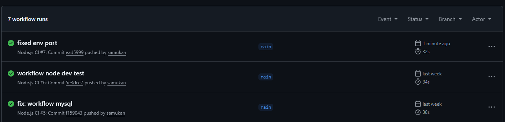

# Simple Node CI/CD demo including integration testing

What I did

- Created a small Node.js API with integration and unit tests. The tests exercise successful API responses and error handling.
- Added a GitHub Actions pipeline (`.github/workflows/node.js.yml`) to run tests on push. The workflow installs dependencies, prepares a test database in the runner (when needed), runs unit and integration tests, and demonstrates how secrets/.env can be provided.
- Kept database setup separated in `db/create-db.sql` and use environment variables for credentials.

Repository: https://github.com/samukan/node-ci-intro

Workflow screenshot

Tests & code based on <https://github.com/ilkkamtk/integration-testing-ready>

## Testing Scenarios

Testing successful API responses and error handling. The test cases for both scenarios are provided in the test folder.
